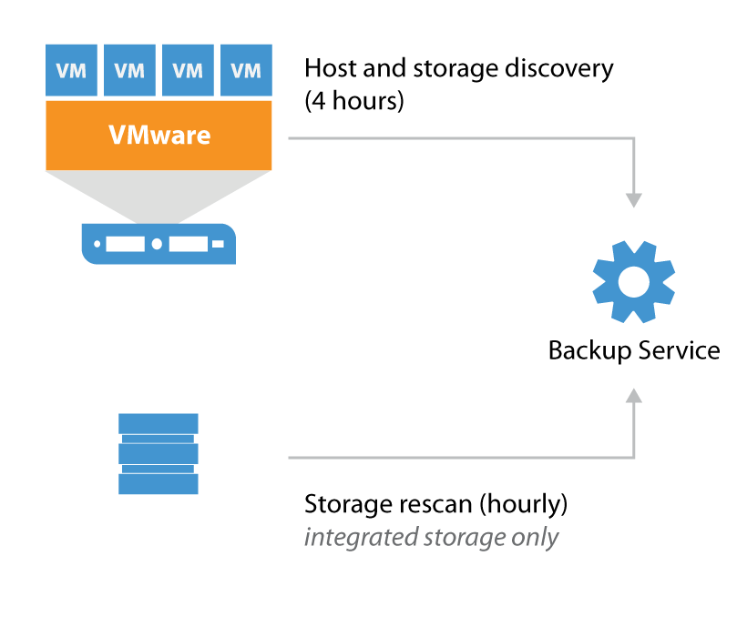

Host and Storage Discovery
==========================
# **Host and Storage Discovery**

To collect information about the virtual infrastructure all managed vCenters and their connected hosts and datastores are periodically rescanned. This rescan process is visible in the History tab in the Veeam Backup & Replication console. The Host discovery process runs every four hours and all the collected information is stored within the configuration database.

### Best Practice Notes

The scan of a storage controller performs, depending on the protocol, several tasks on the storage operating system. Therefore it is recommended to have some performance headroom on the controller. If your controller is already running on >90% CPU utilization, keep in mind that the scan might take significant time to complete.
The scanning interval of 10 minutes and 7 days can be changed with the following registry keys.

*Defines in seconds how frequent we should monitor SAN infrastructure and run incremental rescan in case of new new instances*

**Path:** HKEY_LOCAL_MACHINE\SOFTWARE\Veeam\Veeam Backup and Replication
**Key:** SanMonitorTimeout
**Type:** REG_DWORD
**Default** value: 600

*Defines in days how frequent we should initiate periodic full rescan after Veeam Backup service rescan Per default Veeam will scan all volumes and LUNs on the storage subsystem.*

**Path:** HKEY_LOCAL_MACHINE\SOFTWARE\Veeam\Veeam Backup and Replication
**Key:** SanRescan_Periodically_Days
**Type:** REG_DWORD
**Default** value: 7

 During rescan, each present snapshot produces a snapshot clone, mounts to a proxy server, scans the filesystem, lookup for discovered VMs and unmounts. This is repeated for every present snapshot.

### [More in-depth information on this item](../Section_2/More_information_on_Host_and_Storage_Discovery.md).

### Link to external resources such as Help Guide and Vendor websites

[Link to vSphere User guide on Veeam ](https://helpcenter.veeam.com/docs/backup/vsphere/storage_rescan.html?ver=95u4)
