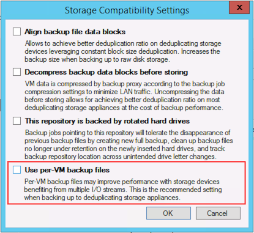

# Per VM backup files

It is possible to write one backup file chain per each VM on a repository, compared to the regular chain holding data for all the VMs of a given job. This option greatly eases job management, allowing to create jobs containing much more VMs than jobs with single chains, and also enhances performance thanks to more simultaneous write streams towards a repository, even when running a single job.

In addition to optimizing write performance with additional streams to multiple files, there are other positive side effects as well. When using the forward incremental forever backup mode, you may experience improved merge performance. When backup file compacting is enabled, per VM backup files require less free space: instead of requiring sufficient space to temporarily accommodate an additional entire full backup file, only free space equivalent to the largest backup file in the job is required. Parallel processing to tape will also have increased performance, as multiple files can be written to separate tape devices simultaneously.

## Maximum number of VMs per job

With per VM backup files the recommendation for number of VMs per job can be increased significantly. Even if technically jobs containing five thousands VMs have been successfully tested in a lab, feedback from the field shows a sweet spot at around 300 VMs per backup job, more for management reasons and unexpected side effects than pure performance matters.

When designing your jobs, keep in mind that several operations such as synthetic operations, health checks and Backup Copy Jobs will be pending until all VMs in the job have completed successfully. For those reasons, extremely large jobs may be impractical.

## Performance

To avoid counter productive effects, attention should be paid on not having too many write threads towards a storage used as a repository. For example, a low range NAS storage will probably not react very well to a high amount of parallel processes created by per VM backup files. To limit this effects, refer to Repository configuration options, especially the **Concurrent tasks** limit.

## Deduplication

Using Per VM backup file will negatively impact repository space usage since Veeam deduplication is file based. If backup jobs have been created while grouping similar guests to optimize deduplication and if Active Full is used, per VM Backup chain might require additional repository space.

